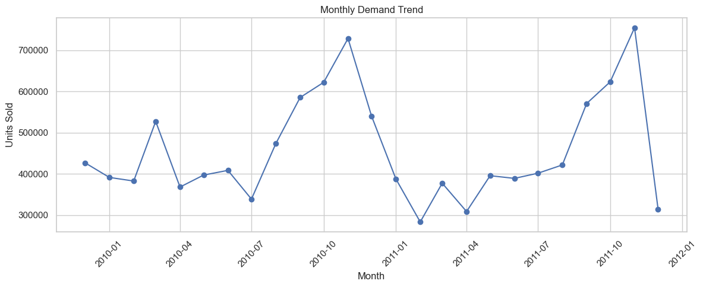
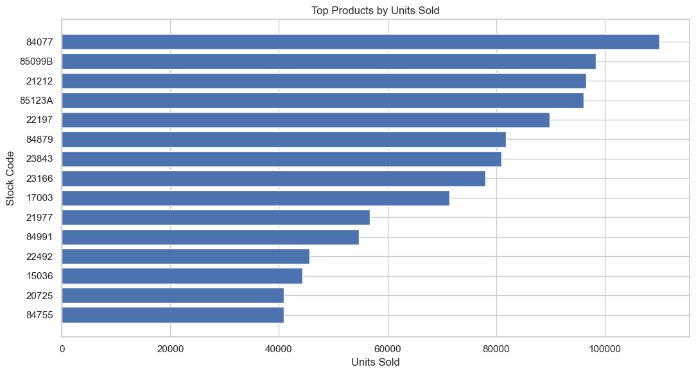
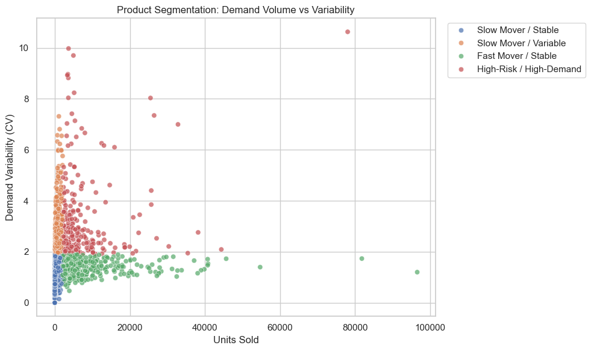

<!DOCTYPE html>
<html>
<body>
<h1>Inventory Optimization & Supply Chain Strategy</h1>

<h2>Project Overview</h2>

This project focuses on improving inventory management decisions by applying supply chain analytics 
to identify demand patterns, evaluate inventory risks, and develop practical optimization strategies. 
Using historical sales data, the analysis examines product performance, demand variability, and inventory 
requirements to help businesses maintain the right balance between product availability and inventory cost.

The project explores key inventory management concepts such as demand analysis, safety stock planning, 
reorder point optimization, and product prioritization. The goal is to provide managers with data-driven 
insights that support better purchasing decisions, reduce the risk of stockouts or excess inventory, 
and improve overall supply chain efficiency.

Rather than focusing only on technical analysis, this project translates data findings into actionable 
business recommendations, allowing decision makers to understand which products require closer monitoring, 
where inventory risks exist, and how inventory policies can be improved.

<h2>Business Objectives</h2>
<ul>
<li>Analyze product demand patterns.</li>
<li>Identify inventory risks and variability.</li>
<li>Recommend practical inventory policies.</li>
<li>Support management decision making.</li>
</ul>

<h2>Project Skills</h2>
Supply Chain Analytics
Inventory Management
Demand Analysis
Safety Stock
Reorder Point
Decision Analytics

<h2>Project Analysis & Insights</h2>

<h3>Monthly Demand Trend</h3>

This chart shows the change in customer demand over time, highlighting seasonal patterns 
and fluctuations in sales volume. Understanding these trends helps managers anticipate 
demand changes, improve forecasting accuracy, and plan inventory levels more effectively.

<h3>Top Products by Units Sold</h3>

This chart identifies the highest-performing products based on sales volume. These products 
represent key drivers of revenue and require careful inventory monitoring to maintain 
availability and avoid stockouts.

<h3>Product Segmentation: Demand Volume vs Variability</h3>

This analysis classifies products based on demand volume and demand variability. It helps 
managers distinguish between stable products, slow-moving items, and high-risk products 
that require different inventory strategies and planning priorities.

<h2>Management Impact</h2>

The analysis converts raw transaction data into actionable inventory recommendations,
helping managers prioritize products, reduce operational risks, and improve planning.

</body>
</html>
